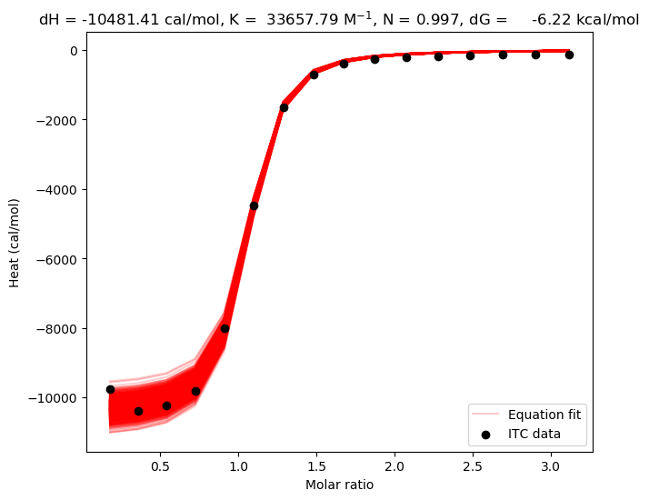

# Bootstrap experimental ITC data using realistic estimates of errors

## How it works

This program analyzes data from VPITC and ITC200 ITC calorimeters.
The data format is expected to be in 2 columns, formatted like: DH(Heat release dQi) delta(Vi) (Volume of injection i).
Additional columns are ignored. Please see the included file for an example. 
The first line of the input is assumed to be a header and discarded; the last line of the input is assumed to be a footer and is discarded.
The default values---and explanation---of the syringe error, cell error, heat error, and base error are taken from:

**Evaluation and Minimization of Uncertainty in ITC Binding Measurements: Heat Error, Concentration Error, Saturation, and Stoichiometry**
Samuel A. Kantonen, Niel M. Henriksen, Michael K. Gilson
*Biochimica et Biophysica Acta (BBA) - General Subjects* (2017-02) <https://doi.org/f9px57>
DOI: [10.1016/j.bbagen.2016.09.002](https://doi.org/10.1016/j.bbagen.2016.09.002) · PMID: [27599357](http://www.ncbi.nlm.nih.gov/pubmed/27599357) · PMCID: [PMC5195854](http://www.ncbi.nlm.nih.gov/pmc/articles/PMC5195854)

These values are currently hard coded at the top of the file and can be easily changed.

Equations for the ITC model are taken from Appendix A in the [MicroCal manual](http://www.isbg.fr/IMG/pdf/microcal-itc200-system-user-manual-malvern.pdf). Specifically, equations 1 through 10.

Briefly, in each bootstrap cycle, the code resamples the syringe concentration, the cell concentration, and the heat released after each injection, using a Gaussian distribution assuming normally distributed errors. Then, employing equation 9 in the MicroCal manual, a curve is fit to the resampled Wiseman plot, returning the total heat `Q[i]` after the `i`th injection and the change in heat normalized by the amount of injectant `dQ[i]`. The boostrapped means and standard error of the means is reported after 1000 bootstrap cycles.

## Running

```
$ python itc_fit.py --help
usage: itc_fit.py [-h] -f FILE [-s SKIP] [-t TEMPERATURE] [-M M0] [-X X0]

optional arguments:
  -h, --help            show this help message and exit
  -f FILE, --file FILE  Raw ITC data
  -s SKIP, --skip SKIP  Number of injections to skip (default: 0)
  -t TEMPERATURE, --temperature TEMPERATURE
                        Temperature of the experiment (default: 300.15 K)
  -M M0, --M0 M0        Cell concentration in Molar (default: 0.005 M)
  -X X0, --X0 X0        Injectant concentration in Molar (default: 0.075 M)
  ```

The only mandatory argument is the data file. The `--skip` argument will skip injections from the *beginning* of the file.

## Example

Running the code on the included example file will produce output consistent with the following the results:

```
$ python itc_fit.py --file data/bCDRrim2.DAT -M 0.0025 -X 0.0375
███████████████████████████████████████████████████████████████████████████████████████| 1300/1300 [00:11<00:00, 115.66it/s]
Cell volume =        0.0002020 L
Cell conc. =         0.0025000 M
Injectant conc. =    0.0375000 M
Syringe error =      2.00 percent
Cell error =         2.00 percent
Heat error =         1.00 percent
Base error =         0.15 ucal
# dH =                   -10.47 +/-    0.42502 kcal/mol
# dH =                   -43.81 +/-    1.77829 kJ/mol
# K =                  33632.48 +/- 1496.19068 M^{-1}
# N =                      1.00 +/-    0.02871
# dG =                    -6.22 +/-    0.02653 kcal/mol
# dG =                   -26.01 +/-    0.11102 kJ/mol
# dS =                -14.16835 +/-    1.41879 cal/mol/K
# dS =                -59.28036 +/-    5.93621 J/mol/K
```

And generate a plot similar to this:




## Installation

This Python 3 code depends on `numpy` for data processing, `scipy` for curve fitting, `matplotlib` for plotting, and `tqdm` for a progress bar, which can be installed using `pip install tqdm`.

## Contributors

- David Slochower 
- Niel Henriksen
- Michael Schauperl
- Katy Kellett